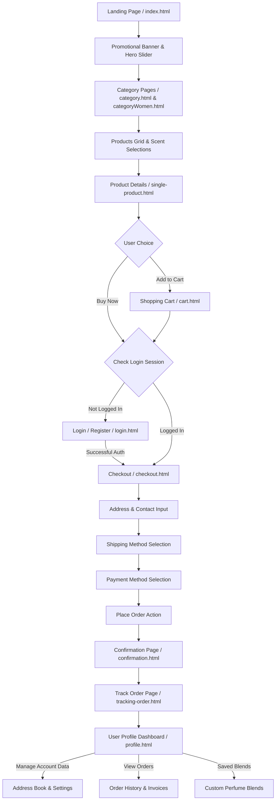

# I Rasa Perfumes - E-Commerce System Architecture & Workflows

This document details the system architecture, navigation workflows, data flow, and page structures for the **I Rasa Perfumes** e-commerce application. It is designed to provide other agents, developers, and model-based servers with a comprehensive view of the system.

---

## 1. System Workflow & User Journey

The following diagram illustrates the complete workflow of a user purchasing a fragrance, starting from the landing page down to confirmation, tracking, and account management.



---

## 2. Core Modules & Page Details

### 2.1. Discovery & Selection
* **Landing Page (`index.html`)**: Introduces the premium design language (vibrant gold gradients, dark backgrounds). Contains the main promotional slider, category navigation links, trending perfumes, and testimonials.
* **Category Pages (`category.html` & `categoryWomen.html`)**: Features product catalog filtering by notes (woody, floral, fresh, etc.) and tags. Displays ratings, dynamic price badges, and offers a hovering "Quick Preview" search modal.
* **Attar Collection (`attar.html`)**: A specialized directory showcasing handcrafted, concentrated, alcohol-free perfume oils.
  * *Pricing Model*: Standard (8ml = Rs. 150/- base) and Premium (8ml = Rs. 200/- base) bottle sizes (6ml, 8ml, 12ml).
  * *Auto-calculation*: The page dynamically computes prices using:
    $$\text{Price} = \text{RoundToNearest10}\left(\frac{\text{Base8ml}}{8} \times \text{Size}\right)$$
  * *CTA buttons*: Action buttons read **"ADD ONLY"** for instant selection, emphasizing high-grade exclusivity.
* **Customization Lab (`customize.html`)**: Allows users to configure bespoke blends by combining base elements and ratios, then saving their recipe.

### 2.2. Cart & Authentication
* **Shopping Cart (`cart.html`)**: Dynamically reads items from local storage, updates totals, quantity pickers, and shipping rules.
* **Authentication (`login.html` & `register.html`)**: Prompts the user to log in or register before checking out if their active session check fails.

### 2.3. Checkout & Ordering Pipeline
* **Checkout (`checkout.html`)**: Conducts a three-phase pipeline:
  1. **Address Entry**: Submits billing/shipping addresses.
  2. **Shipping Option**: Computes handling costs.
  3. **Payment Method**: Offers card processing or Cash on Delivery options.
* **Order Confirmation (`confirmation.html`)**: Displays order summaries, invoice generators, and transaction success details.
* **Tracking (`tracking-order.html`)**: Visual progress timeline for placed orders (Placed $\rightarrow$ Packed $\rightarrow$ Shipped $\rightarrow$ Delivered).

---

## 3. The User Profile Dashboard (`profile.html`)

The profile page is the central hub for registered customers to manage data, view orders, and apply preferences:

```
┌────────────────────────────────────────────────────────┐
│                   PROFILE BANNER                       │
│  [Avatar Image]   Rahul Sharma (rahul@example.com)     │
│                                                        │
│  [Account] [Orders] [Addresses] [Blends] [Security]    │
└────────────────────────────────────────────────────────┘
```

* **Account Info**: Allows updating first name, last name, phone number, and birth date. Integrates with the backend endpoints (e.g., `/api/profile/me`).
* **Order History**: Lists active and past orders, featuring:
  * Dynamic tracking steps (timeline bars showing delivery progress).
  * Invoice generation and download controls.
  * "Reorder" shortcuts for past purchases.
* **Saved Addresses**: Manages home/work address cards with options to delete, edit, or mark addresses as primary.
* **Custom Blends**: Lists custom-designed fragrance recipes retrieved from local storage key (`irasa_profile`).
* **Security & Preferences**: Account deletion triggers, newsletter subscriptions, and password updates.

---

## 4. Technical Integration & Data Sync

1. **Session-Based Authentication**: The system secures user access through cookie-based session tracking.
   * **Authentication Guard**: Pages like `checkout.html` and `profile.html` include `js/auth-guard.js`, checking user login status by calling api endpoints with `{ credentials: 'include' }` to pass the session cookie.
   * **Security Policies**: Session cookies are configured securely (HTTP-only and Secure flags on production) to protect user credentials, authentication state, and session keys from XSS and access token theft.
   * **Redirects**: Unauthenticated actions redirect the user to `login.html`, and successful logins re-establish the session state.
2. **API Endpoint Base**:
   * *Localhost Development*: `http://localhost:8080/api/profile`
   * *Production Host*: `/api/profile`
3. **Local Cache Storage Key**: `irasa_profile` caches client-side states (e.g., saved blends, local preferences, cart totals).
4. **Style Consistency**: Page layouts utilize `css/style.css` for custom gold-toned scrollbars, buttons, modal dialog styles, card overlays, and dark-theme branding.
